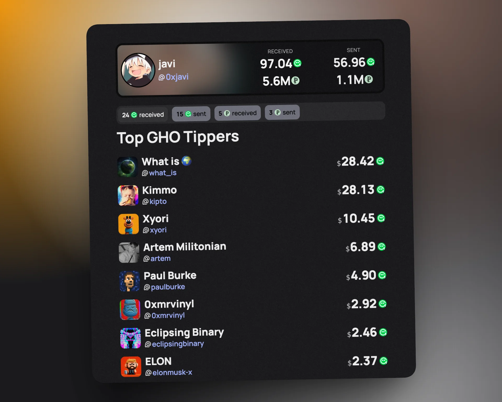

# LCTips

A Next.js application for visualizing tips on Lens Chain. Search for Lens protocol users and explore their tip transaction history (both sent and received) in GHO, BONSAI, and POINTLESS tokens. Discover new profiles by seeing who tips the people you love — find new accounts through tipping activity!

> **Note:** Most Lens clients no longer support tipping in BONSAI. Historical BONSAI tips are still tracked, but new activity is rare.

🌐 **Live Demo**: [https://lctips.xyz](https://lctips.xyz)



## Features

- 🔍 **Real-time Search** - Find Lens protocol users with 300ms debounced search
- 💸 **Tip Visualization** - View sent and received tips in GHO, BONSAI, and POINTLESS
- 📊 **Transaction Aggregation** - Grouped and sorted tip history by sender/receiver
- ⚡ **Fast Performance** - Built with Next.js 15, Turbopack, and React 19
- 📱 **Responsive Design** - Beautiful UI with TailwindCSS v4 and Radix UI
- 🔗 **Web3 Integration** - Connect wallets with ConnectKit and Wagmi
- 👀 **Profile Discovery** - See who tips your favorite people and discover new profiles through tipping

## Tech Stack

### Core Technologies
- **Next.js 15** with App Router and Turbopack
- **React 19** with TypeScript
- **TailwindCSS v4** with tw-animate-css
- **Lens Protocol SDK** (@lens-protocol/react, @lens-protocol/client)
- **Wagmi/ConnectKit** for Web3 wallet connections

### Blockchain & APIs
- **ethers.js** for blockchain interactions
- **Lens Chain** (RPC: https://rpc.lens.xyz/)
- **Lens Explorer API** for transaction history
- **Lens GraphQL API** for profile data

### UI & Animation
- **Radix UI** components
- **Framer Motion** for animations
- **@number-flow/react** for animated number transitions
- **Lucide React** icons

## Getting Started

### Prerequisites

- Node.js 18+ and npm

### Installation

1. **Clone the repository**
   ```bash
   git clone https://github.com/JaviEzpeleta/lctips.git
   cd lctips
   ```

2. **Install dependencies**
   ```bash
   npm install
   ```

3. **Environment Setup**
   ```bash
   cp .env.example .env.local
   ```
   Then edit `.env.local` and add your WalletConnect Project ID (get one at [cloud.walletconnect.com](https://cloud.walletconnect.com)).

4. **Run the development server**
   ```bash
   npm run dev
   ```

5. **Open in browser**
   Navigate to [http://localhost:3000](http://localhost:3000)

### Build for Production

```bash
npm run build
npm start
```

## Project Structure

```
├── app/                    # Next.js app router
│   ├── api/               # API routes
│   │   ├── profile/       # Main profile + tips endpoint
│   │   ├── basic-profile/ # Basic profile data
│   │   ├── profile-data-by-address/ # Profile lookup by address
│   │   └── all-rewards/   # Rewards aggregation
│   ├── (tips)/            # Route group
│   │   ├── u/[handle]/    # Dynamic user profile pages
│   │   └── rewards/       # Rewards leaderboard
│   └── ...                # Layout, global styles, root page
├── components/            # React components
│   ├── search/           # Search functionality
│   ├── ui/               # UI library components
│   └── ...               # Tip display, loading states, profile views
├── lib/                  # Core utilities
│   ├── lens-api.ts       # Lens Protocol GraphQL client
│   ├── lens-explorer.ts  # Transaction fetching via Lens Explorer
│   ├── constants.ts      # App constants
│   ├── types.ts          # TypeScript type definitions
│   ├── utils.ts          # Utility functions
│   ├── time.ts           # Time formatting helpers
│   └── graphql/          # GraphQL queries & mutations
├── hooks/                # Custom React hooks
└── public/               # Static assets
```

## Key Features Explained

### Transaction Processing
1. **Profile Search** - Users search for Lens handles with real-time results
2. **Data Fetching** - Parallel fetching from multiple APIs:
   - Lens GraphQL API for profile data
   - Lens Explorer API for transaction history (paginated)
   - ethers.js for GHO transaction details
3. **Aggregation** - Groups transactions by sender/receiver, sums amounts, applies 0.01 minimum threshold
4. **Visualization** - Displays in organized tabs with animated counters

### Supported Tokens
- **GHO** - Native Lens Chain currency (primary tipping token)
- **BONSAI** - Bonsai token tips *(most Lens clients no longer support Bonsai tipping — historical data only)*
- **POINTLESS** - Pointless token tips

## Contributing

Contributions are welcome! Please feel free to submit a Pull Request.

### Development Guidelines

- Follow existing code style and patterns
- Keep console.log statements to essential error logging only
- Use TypeScript for type safety
- Test your changes before submitting

## License

This project is open source and available under the [MIT License](LICENSE).

## Acknowledgments

- Built for the Lens Protocol ecosystem
- Uses Lens Chain infrastructure
- UI components from Radix UI

---

**Note**: This application is designed specifically for Lens Chain and may not work with other blockchain networks without modification.
